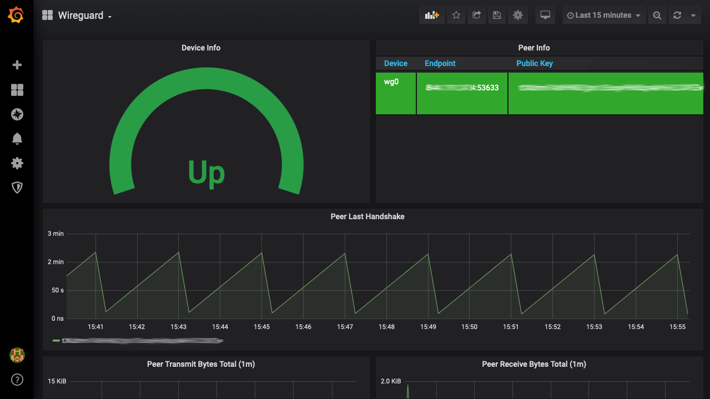

# wireguard_exporter [](https://builds.sr.ht/~mdlayher/wireguard_exporter?) [](https://godoc.org/github.com/mdlayher/wireguard_exporter) [](https://goreportcard.com/report/github.com/mdlayher/wireguard_exporter)

Command `wireguard_exporter` implements a Prometheus exporter for WireGuard
devices. MIT Licensed.

## Example

This exporter exposes metrics about each configured WireGuard device and its
peers, using any device implementation supported by [wgctrl-go](https://github.com/WireGuard/wgctrl-go).

```text
$ curl -s http://localhost:9586/metrics | grep wireguard
# HELP wireguard_device_info Metadata about a device.
# TYPE wireguard_device_info gauge
wireguard_device_info{device="wg0",public_key="TM7UyJLMf7nPvWC4fb5xoEQedgQ9RwyyEaWGk1Zrow4="} 1
# HELP wireguard_peer_info Metadata about a peer. The public_key label on peer metrics refers to the peer's public key; not the device's public key.
# TYPE wireguard_peer_info gauge
wireguard_peer_info{allowed_ips="192.168.20.0/24",device="wg0",endpoint="192.168.1.150:51820",name="example",public_key="2RTeXgsWP9siIqULJukjlfA3SRYA3R6YsVnJ5GUzu3o="} 1
# HELP wireguard_peer_last_handshake_seconds UNIX timestamp for the last handshake with a given peer.
# TYPE wireguard_peer_last_handshake_seconds gauge
wireguard_peer_last_handshake_seconds{public_key="2RTeXgsWP9siIqULJukjlfA3SRYA3R6YsVnJ5GUzu3o="} 1.558580872e+09
# HELP wireguard_peer_receive_bytes_total Number of bytes received from a given peer.
# TYPE wireguard_peer_receive_bytes_total counter
wireguard_peer_receive_bytes_total{public_key="2RTeXgsWP9siIqULJukjlfA3SRYA3R6YsVnJ5GUzu3o="} 0
# HELP wireguard_peer_transmit_bytes_total Number of bytes transmitted to a given peer.
# TYPE wireguard_peer_transmit_bytes_total counter
wireguard_peer_transmit_bytes_total{public_key="2RTeXgsWP9siIqULJukjlfA3SRYA3R6YsVnJ5GUzu3o="} 2960
```

### Sample queries

Get the receive and transmit rates of individual peers, and enable querying on
both the WireGuard device name and the peer's friendly name:

```
irate(wireguard_peer_receive_bytes_total[1m]) * on (public_key) group_left(name) wireguard_peer_info * on (instance) group_left(device) wireguard_device_info
```
```
irate(wireguard_peer_transmit_bytes_total[1m]) * on (public_key) group_left(name) wireguard_peer_info * on (instance) group_left(device) wireguard_device_info
```

## Grafana Dashboard

You can view your data using this [Grafana Dashboard](https://grafana.com/grafana/dashboards/12177) using Prometheus as source.



## Build Binary 

```
cd cmd/wireguard_exporter/
go build .
mv wireguard_exporter /usr/local/bin/
```

## Add service file for systemd

```
[Unit]
Description=Prometheus WireGuard Exporter
After=network.target

[Service]
Type=simple
Restart=always
ExecStart=/usr/local/bin/wireguard_exporter

[Install]
WantedBy=multi-user.target
```

Load new service and enable autostart:

```
systemctl daemon-reload
systemctl enable wireguard-exporter.service
```

## Add scraping config to prometheus

In `/etc/prometheus/prometheus.yml` add following config to the section `scrape_configs:` :

```
  - job_name: wireguard
    static_configs:
      - targets: ['localhost:9586']
```
